# 安装手册

## 1.下载小狼毫  
打开小狼毫输入法官网[https://rime.im/download/](https://rime.im/download/)  
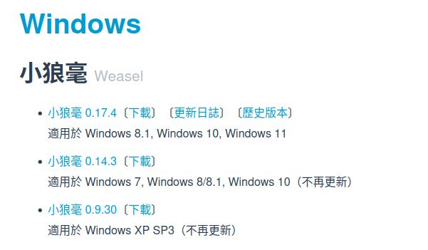  

## 2.安装小狼毫  
下载完成后打开安装包  

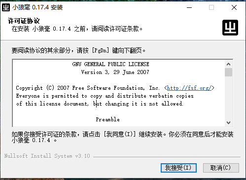  
点击`我接受`  

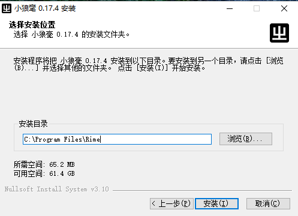  
安装目录默认即可,点`安装`    

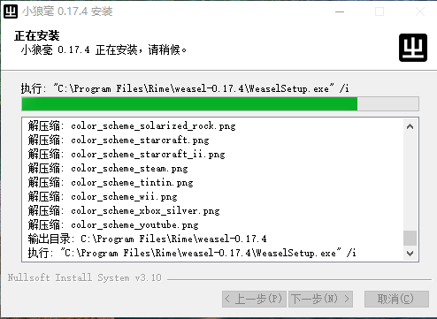  
开始安装  

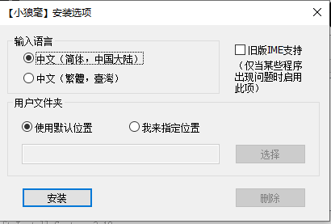  
弹出的窗口直接点`安装`  

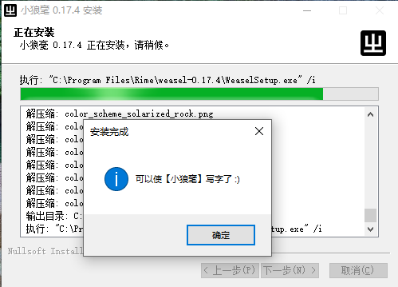  
点击`确定`  

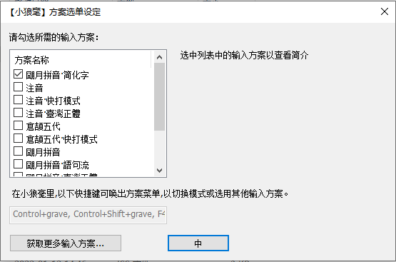  
* 第二个弹窗只需要勾选`朙月拼音·简化字`,其它的都要取消  
然后点击`中`  

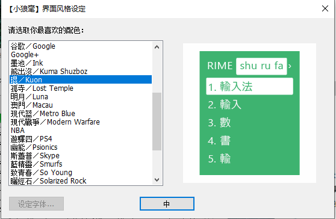  
风格任意选一个,然后点击`中`  

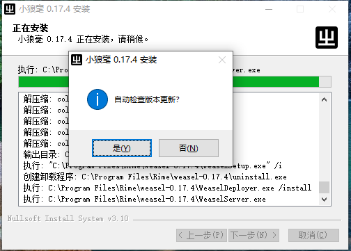  
点击`否`  

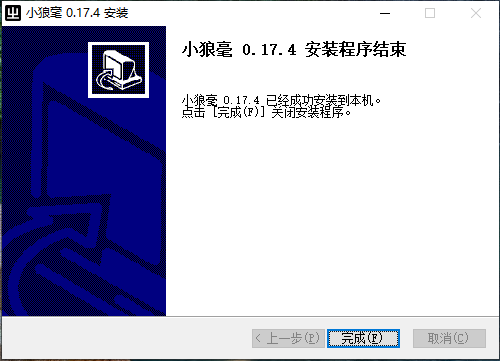  
最后点击`完成`  

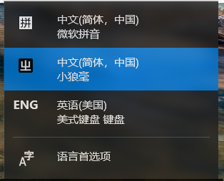  
现在点击系统右下角的输入法就可以切换到小狼毫打字了  

## 3.安装脚本  

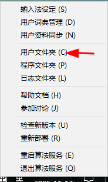  
当输入法切换到小狼毫时,可以右击系统右下角的🀄字,选择`用户文件夹`  

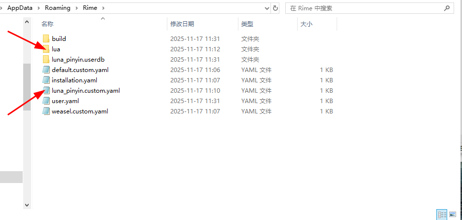  
把文件夹`lua`和文件`luna_pinyin.custom.yaml`复制到这个路径下  

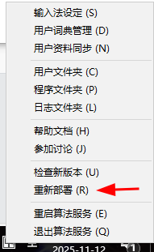  
再次右击系统右下角的🀄字,选择`重新部署`  

