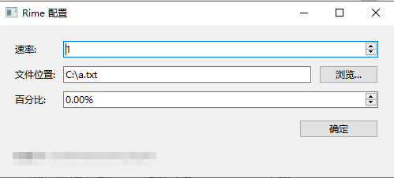

# 小说导入教程

从[此链接](https://github.com/unfiled0/librime-lua-water/releases/download/v0.0.1/water_config.exe) https://github.com/unfiled0/librime-lua-water/releases/download/v0.0.1/water_config.exe 下载编译好的程序

双击打开,点击 `浏览`选中要导入的小说(仅支持txt文件),点击 `确定`后, 参照 `安装手册`中进行 `重新部署`即可

说明:

* 速率: 表示打字倍速
* 百分比: 表示小说打字百分比进度
